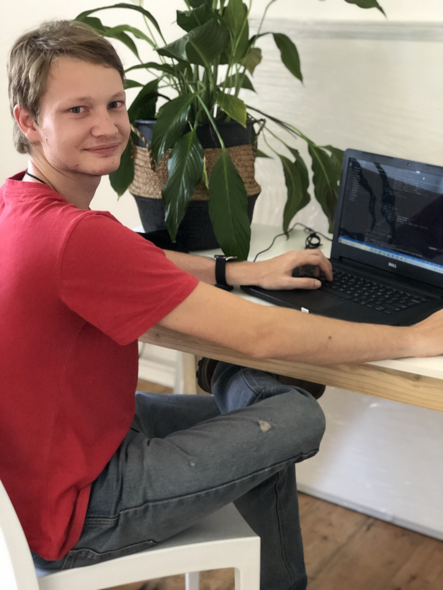
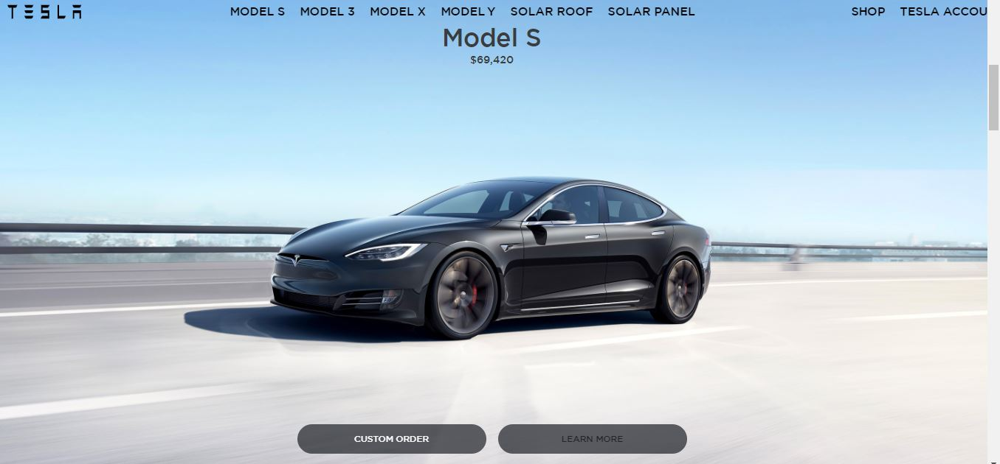
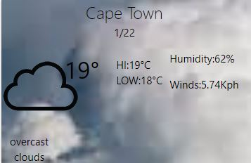
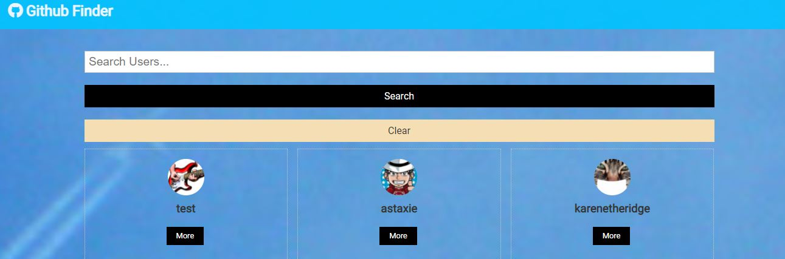

<!DOCTYPE html>
<html lang="en">
<head>
    <meta charset="UTF-8">
    <meta name="viewport" content="width=device-width, initial-scale=1.0">
    <title>Michael Bruwer</title>
    <link rel="stylesheet" href="style.css">
    
    
    
    
    
    <link rel="stylesheet" href="https://cdnjs.cloudflare.com/ajax/libs/OwlCarousel2/2.3.4/assets/owl.carousel.min.css"/>

</head>
<body>
    

        <i class="fas fa-angle-up"></i>
    

    <nav class="navbar">
        
   
            

                <ul class="menu">
                    <li><a href='https://github.com/MichaelBruwer' ><i class="fab fa-github fa-lg"></i></a></li>
                    <li><a href='https://www.linkedin.com/in/michael-bruwer-2806a41a9/'><i class="fab fa-linkedin fa-lg"></i></a></li>
                </ul>
            
         
            <ul class="menu">
                <li><a href="#home" class="menu-btn">Home</a></li>
                <li><a href="#about" class="menu-btn">About</a></li>                
                <li><a href="#skills" class="menu-btn">Skills</a></li>   
                <li><a href="#work" class="menu-btn">Work</a></li>              
                <li><a href="#contact" class="menu-btn">Contact</a></li>
            </ul>
            

                <i class="fas fa-bars"></i>
            

        

    </nav>

    <!-- home section start -->
    <section class="home" id="home">
        

            

                
Hello, my name is

                
Michael Bruwer

                
And I'm a 

                
  

            

        

    </section>

    <!-- about section start -->
    <section class="about" id="about">
        

            <h2 class="title">About me</h2>
            

                

                    
                

                

                    
I'm Michael and I'm a 

                    

                        I am an aspiring Developer with a passion for gaming.
                        i am a trustworthy, respectful, organized, adaptable and truthful person
                        who is looking to pursue a long-term career in IT and meet some
                        new and interesting people along the way. I have been around computers
                        most of my life mainly dealing with hardware but also occasionally
                        loading software for people aswell as having some family that are Developers.
                        This close contact has fuelled the passion for coding.

                    <a href="Portfolio01/images/Michael Bruwer Resume.pdf">Download CV</a>
                

            

        

    </section>

    <!-- skills section start -->
    <section class="skills" id="skills">
        

            <h2 class="title">My skills</h2>
            

                

                    
My skills & experiences.

                    
i'm an Intern Developer at LC-Studio,
                         and i work with Web based applications normally
                          with React Js as a front end and a python backend
                           sometimes using the Django framework

                

                

                    

                        

                            HTML
                            90%
                        

                        

                    

                    

                        

                            CSS
                            60%
                        

                        

                    

                    

                        

                            ReactJs
                            80%
                        

                        

                    

                    

                        

                            Python
                            50%
                        

                        

                    

                    

                        

                            Mysql
                            20%
                        

                        

                    

                    

                

            

        

    </section>

    <!-- work section start -->
    <section class="work" id="work">
        

            <h2 class="title">My work</h2>
            

                

                     

                      
                        
Tesla-clone

                        
A Tesla Home-page clone done with reactJs

                    

                

                

                    

                    
                        
Weather Widget

                        
A Widget that displays the weather details.

                    

                

                

                    

                     
                        
Github Finder

                        
 A Github account Finder Built useing ReactJs.

                    

                

                <!-- 

                    <a href='/#' >
                    

                        
                        
Project Name

                        
Lorem ipsum dolor sit amet consectetur adipisicing elit.

                    

                </a>
                

                

                    <a href='/#' >
                    

                        
                        
Project Name

                        
Lorem ipsum dolor sit amet consectetur adipisicing elit.

                    

                </a>
                

            
 -->
        

    </section>

    <!-- contact section start -->
    <section class="contact" id="contact">
        

            <h2 class="title">Contact me</h2>
            

                

                   

                        

                            <i class="fas fa-user"></i>
                            

                                
Name

                                
Michael Bruwer

                            

                        

                        

                            <i class="fas fa-map-marker-alt"></i>
                            

                                
Address

                                
Cape Town, South Africa

                            

                        

                        

                            <i class="fas fa-envelope"></i>
                            

                                
Email

                                
michaelbruwer21@gmail.com

                            

                        

                    

                

                

                    
Message me

                    <form action="mailto:michaelbruwer21@gmail.com" method="post" enctype="text/plain">
                        

                            

                                <input type="text" name="name" placeholder="Name" required>
                            

                            

                                <input type="email" name="email" placeholder="Email" required>
                            

                        

                        

                            <input type="text" name="subject" placeholder="Subject" required>
                        

                        

                            <textarea cols="30" rows="10" name="message" placeholder="Message.." required></textarea>
                        

                        

                            <button type="submit">Send message</button>
                        

                    </form>
                

            

        

    </section>

    

</body>
</html>
